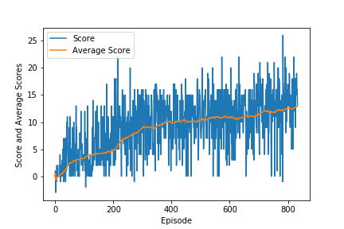

# Navigation Project Submission

The 

## Training Results
* The agent achieves an average score of 13 or above in 834 episodes.
* The progression of the scores and the average score is shown in the next figure.

## Future Enhancements
* The hyperparameters for the algorithm have been chosen by trial and error. Better parameters can be found by using an automated hyperparameter search techniques.
* Intuitively,  increasing the number of training samples should improve the time performance, but would it woul also increase the training time. Prioritized experienced replay can improve the performance with less increase in training time.
* One open question is how to reduce the variance in the scores. The average score is improved as a result of training, but the scores vary a lot around this average value.